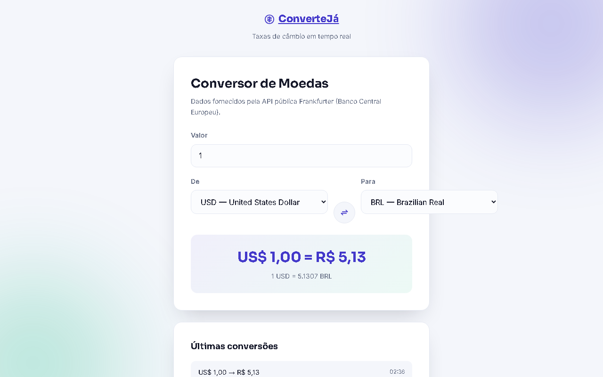

# ConverteJá — Conversor de Moedas em Tempo Real

Conversor de moedas com taxas de câmbio atualizadas, consumindo a API pública e gratuita
[Frankfurter](https://www.frankfurter.app/) (dados do Banco Central Europeu, sem necessidade de chave de API).

## ✨ Funcionalidades

- Lista de moedas carregada dinamicamente da API (não é uma lista fixa no código).
- Conversão em tempo real ao digitar o valor ou trocar as moedas (com debounce para evitar excesso de requisições).
- Botão de inverter (swap) entre moeda de origem e destino.
- Exibição da taxa de câmbio atual (ex: "1 USD = 5,4231 BRL").
- Histórico das últimas 5 conversões feitas na sessão.
- Estados de carregamento e erro tratados (rede indisponível, valor inválido).
- Totalmente responsivo.

## 🛠️ Stack

- HTML5 semântico e acessível
- CSS3 (Grid/Flexbox, gradientes, variáveis CSS)
- JavaScript (ES6+, `fetch`, `async/await`, `Intl.NumberFormat`)
- [Frankfurter API](https://www.frankfurter.app/docs/) — gratuita, sem chave

## ▶️ Como rodar

Abra o `index.html` no navegador, ou use a extensão **Live Server** no VS Code.
